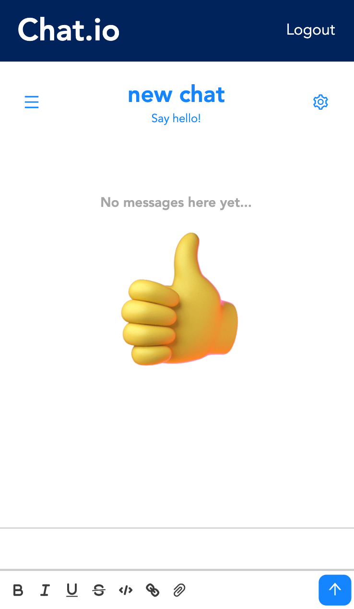
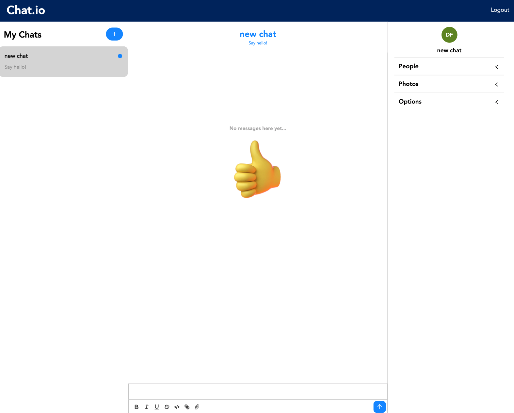

# Chat Application - Chat.io

## Welcome! 👋

This project is a real time chat application built with React and styled components that uses the ChatEngine API for its chat services. User authentication is handled with Firebase so that users can create an account with email/password or sign in with Google to use the application.

In order to communicate with one another multiple accounts have to be made on the app. Then when users create a chat they can add the emails of other accounts registered with the app and begin chatting.

## Table of contents

- [Overview](#overview)
  - [Screenshot](#screenshot)
  - [Links](#links)
- [My process](#my-process)
  - [Built with](#built-with)
  - [Continued development](#continued-development)

## Overview

### Screenshot

| Mobile (375px)                                 | Desktop (1440px)                                 |
| ---------------------------------------------- | ------------------------------------------------ |
|  |  |

### Links

- Live Site URL: [Chat.io](https://festive-euclid-b5c106.netlify.app/)

## My Process

### Built with

- React
- Styled Components
- Chat Engine IO
- Firebase

### Continued development

Currently when the user has no chats and they are on a smaller screen size device, the option to create chats doesn't appear. I plan on making the chat application responsive so that users on smaller device screens can create a chat when they first sign up for the application.
